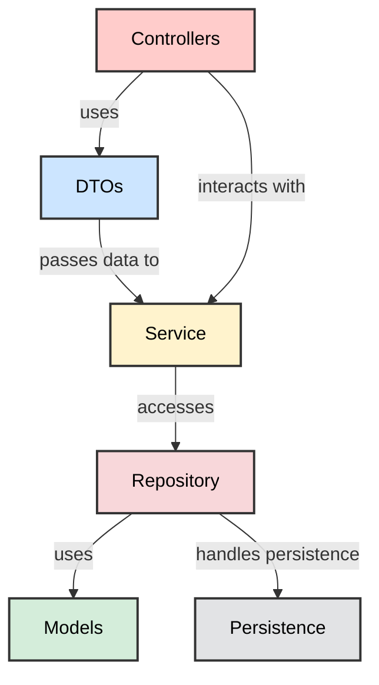

### **Componentes de la Arquitectura Hexagonal**

**Controllers**: Los controladores son los puntos de entrada para las solicitudes externas (solicitudes HTTP). Se
encargan de recibir las solicitudes, convertirlas en comandos o consultas.
> Los controladores interactúan con los **servicios a través de interfaces**, pero no dependen directamente de
> implementaciones concretas.

**DTOs**: Los DTOs transportan datos entre las distintas capas de la aplicación. No contienen lógica de negocio.
> Los DTOs son utilizados por los **controladores** para recibir datos de entrada y enviar respuestas. También pueden
> ser utilizados por los **servicios** para transmitir datos a los **repositorios**.

**Models**: Los modelos representan la estructura de los datos dentro de la aplicación, reflejando cómo se **persisten
los datos**. Actúan como entidades que mapean la estructura de los datos almacenados.
> Los modelos son utilizados por los servicios y repositorios para realizar operaciones sobre los datos y aplicar la
> lógica de negocio. Los **controladores** pueden usar los modelos para interactuar con los servicios.

**Repository**: Los repositorios se encargan de la **persistencia** de los datos. Proporcionan una interfaz para
realizar operaciones CRUD sobre los datos almacenados.
> Los repositorios interactúan con la base de datos y son utilizados por los **servicios** para acceder y manipular los
> datos persistidos. Los servicios delegan la lógica de acceso a datos en los repositorios.

**Service**: Los servicios contienen la **lógica de negocio** de la aplicación. Implementan las operaciones y reglas de
negocio que deben aplicarse a los datos.
> Los servicios interactúan con los **controladores** y los **repositorios**. Reciben comandos o consultas de los
> controladores, procesan la lógica de negocio, y utilizan los repositorios para almacenar o recuperar datos.
